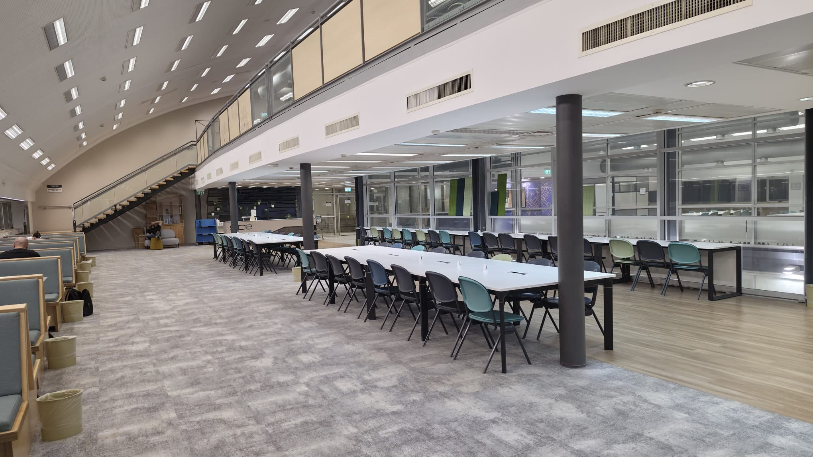
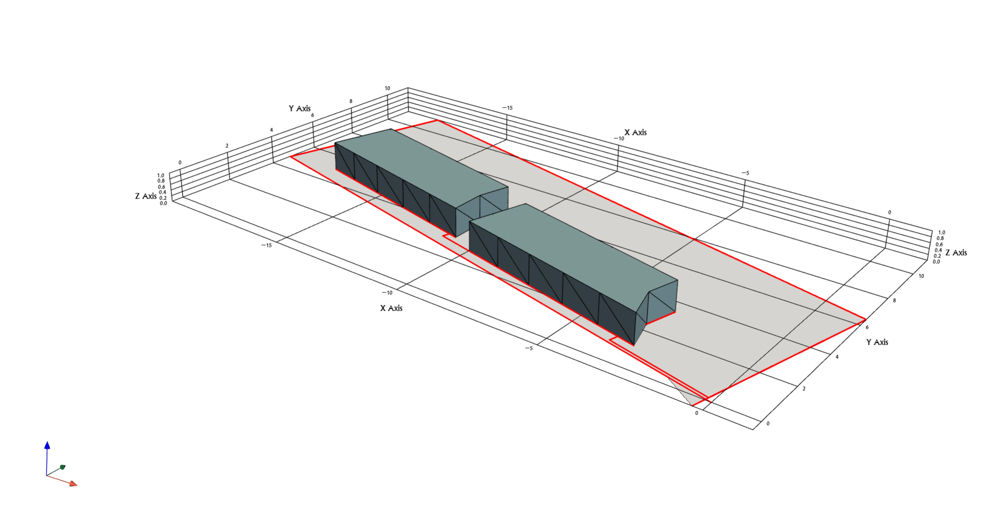

# Foot-Mounted IMU Tracking System

Foot-mounted inertial navigation for indoor mapping and dead reckoning using zero-velocity updates (ZUPT). The system targets under a 5% distance error over 20 m trajectories, utilizing a BMI270 IMU on an nRF52840 (Arduino Nano 33 BLE Rev2) secured via a rigid shoe mount.

## System Performance & Headline Results

| Metric | Result | Target |
| :--- | :--- | :--- |
| **Straight-Line Distance Error** | Mean: +0.51% (Std: 1.47%, Worst single run: 2.59%) across 4 × 20 m walks. | < 5.0% |
| **ZVW Detection Accuracy** | 100% (20/20 on tuning set, 10/10 on held-out validation). | 100% |
| **Loop Timing** | 200 Hz scheduler maintained. Jitter tightly spiked at 5,000 µs. | 5,000 µs |
| **Attitude Stability** | Settled noise σ < 0.01°, ~20 s initial convergence. Dynamic tilt-and-return recovery: < 0.5°. | < 1.0° |
| **Closed-Loop Wall Accuracy** | 2.95% (short walls), 2.14% (long walls) across 11 loops of a tape-measured 2.4 × 6.6 m room. | qualitative |
| **Loop Closure Gap** | 0.212 m after Manhattan snapping (1.18% of an 18 m perimeter), down from 0.699 m unsnapped. | qualitative |
| **Live On-Board Parity** | Wired-BLE walk reproduced the offline map to within 1 mm at 0.322 m closure. Boolean gates bit-exact vs the Python oracle across ~10,000 samples. | Match offline |
| **Object Repeatability** | Two identical tables, walked independently, reconstructed to within 1.6% and 3.0% on linear dimensions. Unmeasured; see Interaction & 2.5D Reconstruction §3. | qualitative |

   
  <em>Figure 1: Final 2D calculated map to a 18m (2.4 x 6.6 m) rectangle.</em>

---

## Algorithm Pipeline & Sensor Fusion

### 1. Attitude Verification & ZVW-Gated Mahony
To prevent the gyroscope from drifting during human gait, a Mahony filter is aggressively gated by the Zero Velocity Window (ZVW) mask. The accelerometer correction only applies when the foot is planted, allowing the filter to run open-loop on the gyro during the swing phase.

**Verification Results (Tuned at $K_p=2.0, K_i=0.5$):**
* **60s Stationary:** Roll -0.994° (σ < 0.01°), Pitch +0.764° (σ < 0.01°). The filter exhibits a ~20 s initial integral convergence before maintaining a stable, flat baseline.
* **Tilt-and-Return:** Recovered with errors of 0.225°/0.153° on one axis, and 0.464°/0.307° on the other, after rapid dynamic excursions to -34° and -41°. 

   
  <em>Figure 2: 80° uncontrolled gyro drift divergence against a bounded trace using the ZVW-gated Mahony filter (tilt residual < 2° measured during ZVW).</em>

### 2. Error Mechanism & Integration Pipeline
The system relies on double integration of linear acceleration, with ZUPT resetting velocity to zero at every stance phase. The causal chain of integration error was identified and quantified:
* **The Mechanism:** Pre-ZUPT velocity predicts the final distance error with a strong correlation ($r = -0.997, n = 4$). 
* **Physics Match:** The fitted slope of this error (-5.70 m per m/s) matches the analytical physical prediction ($\frac{1}{2}vTN$) to within 10%, confirming the causal chain from attitude tilt error $\rightarrow$ gravity leakage $\rightarrow$ integration drift.

   
  <em>Figure 3: Velocity integration with and without Zero Velocity Updates (ZUPT) demonstrating the instantaneous mitigation of linear velocity drift.</em>

### 3. Kp/Ki Tuning & The Controlled Experiment
Initial testing ($K_p=1.0, K_i=0.0$) yielded a 4.16% run-to-run standard deviation. The parameters were retuned against mean absolute pre-ZUPT velocity on the unmeasured long walk to avoid overfitting. 
* **Optimal Gains:** `Kp = 2.0`, `Ki = 0.5`. 

| Metric | Before ($K_p=1.0, K_i=0.0$) | After ($K_p=2.0, K_i=0.5$) | Improvement |
| :--- | :--- | :--- | :--- |
| **Mean Distance Error** | 19.919 m (-0.33%) | 20.087 m (+0.51%) | Unbiased baseline |
| **Distance Std Dev (Scatter)** | 0.831 m (4.16%) | 0.295 m (1.47%) | **2.8× reduction** |
| **Worst Single Run** | 5.65% | 2.59% | **< 5% target met** |

* **The Controlled Experiment:** Applying the retuned gains dropped horizontal (X/Y) tilt residuals by a factor of 20 (tilt error down from ~0.9° to ~0.05°), while vertical (Z) residuals remained unchanged at 0.026 g. This experimentally confirms the decomposition: horizontal residuals stem from filter attitude error, while vertical residuals are uncorrectable accelerometer hardware magnitude bias.

| Run | Z-Residual Before ($g$) | Z-Residual After ($g$) | Horizontal Tilt Error Before | Horizontal Tilt Error After | Tilt Reduction |
| :--- | :--- | :--- | :--- | :--- | :--- |
| **Run 1** | 0.0261 | 0.0264 | 0.81° | 0.049° | 16.5x |
| **Run 2** | 0.0257 | 0.0260 | 0.77° | 0.038° | 20.3x |
| **Run 3** | 0.0233 | 0.0238 | 0.98° | 0.053° | 18.5x |
| **Run 4** | 0.0233 | 0.0233 | 0.37° | 0.011° | 33.6x |

   
  <em>Figure 4: Kp/Ki tuning grid scores showing a broad plateau of stability, proving the selected values (2.0/0.5) generalize and are not overfitted to noise.</em>

### 4. Closed-Loop Validation & Manhattan Snapping

**Objective:** Convert a drifting free-running trajectory into a metric floor plan, and quantify how much of the residual error is recoverable by geometric prior rather than by better estimation.

**Method:** Step vectors are extracted at ZVW midpoints and filtered to strides above 0.2 m to reject micro-movements. Dominant building orientation is recovered by a stride-length-weighted circular mean of step headings taken modulo 90°, which yields a single grid offset per walk. Every step heading is then snapped to the nearest grid axis and the path is reconstructed from the snapped headings, preserving the original step magnitudes. No loop-closure constraint is applied: the closure gap is measured, not enforced.

**Dataset:** 11 closed-loop walks of a tape-measured 2.4 × 6.6 m rectangle (18.0 m perimeter), split across both turn directions and with and without deliberate corner pauses.

| Metric | Result |
| :--- | ---: |
| Mean perimeter | 18.034 m (+0.19% vs 18.0 m tape) |
| Perimeter scatter | 0.199 m (1.11%) |
| Closure gap, unsnapped | 0.699 m (3.88% of perimeter) |
| Closure gap, snapped | 0.212 m (1.18% of perimeter) |
| Best single closure | 0.013 m |

**Per-wall accuracy (n = 22 walls per class):**

| Wall class | Tape | Mean abs error | As % of wall | Mean signed error |
| :--- | ---: | ---: | ---: | ---: |
| Short (2.4 m) | 2.4 m | 0.071 m | 2.95% | -0.056 m |
| Long (6.6 m) | 6.6 m | 0.141 m | 2.14% | +0.073 m |

**Result:** Snapping reduces mean closure gap by 3.3× without imposing a closure constraint, so the improvement is evidence that the heading estimate was genuinely near-orthogonal rather than an artifact of forcing the path shut. Perimeter accuracy is unaffected by snapping because step magnitudes are preserved; the +0.19% figure is the raw ZUPT integration result.

**The resolution limit:** Per-wall error is an absolute floor of roughly 0.1 m, not a percentage. Short walls appear worse only because the same physical error is divided by a smaller number. The mechanism is structural: a wall is measured as an integer number of stance-to-stance vectors, and the corner vertex lands on the nearest detected stance rather than on the true corner, so each wall carries a sub-stride placement error. The signed errors confirm a small real transfer, with short walls losing 0.056 m and long walls gaining 0.073 m, and the four per-wall errors summing to the +0.034 m perimeter error.

**The ZARU Negative Result:** A Zero Angular Rate Update (ZARU) algorithm was fully implemented to combat the empirical session-to-session gyro bias drift. However, controlled closed-loop experiments revealed that applying ZARU degraded closure accuracy (e.g., gap worsened from 1.62 m to 3.03 m on a 3-minute walk). The data proved that the Mahony filter's integral term ($K_i$), when aggressively gated by the ZVW, already fully absorbs the Z-axis bias during stance phases. ZARU was therefore proven redundant for stance-rich walks and deliberately excluded from the final estimation pipeline to prevent double-correction.

Intersecting adjacent snapped wall lines by least squares would place true corner vertices and recover the systematic ~0.06 m component. This was deliberately not built: the recoverable systematic error is smaller than the 0.07 to 0.14 m irreducible random component, so the refinement would improve a metric already at ~3% while leaving the dominant term untouched. Documented as available and unbuilt, alongside the accelerometer calibration.

**Open observation:** Closure gap splits cleanly by turn direction. Clockwise walks average a 0.334 m unsnapped gap; counter-clockwise walks average 1.137 m. Elapsed time was tested as a cause and ruled out: the longest clockwise walk (56.0 s) closed 7.8× tighter than a shorter counter-clockwise walk (46.8 s), and the asymmetry persists at matched 22.9 s durations. The cause is not established and n = 5 for the counter-clockwise group, so no mechanism is claimed here.

   
  <em>Figure 5: Unmeasured long loop walk.</em>

---

## On-Board Port & Live Verification

The offline Python pipeline is the correctness oracle. The embedded system was built to reproduce it exactly, and the port was treated as a transcription to be verified rather than a rewrite to be re-validated.

### 1. Verification Methodology

Reference outputs were frozen from the Python oracle before any C++ was written, covering per-stage quaternion, boolean gate, and step-vector output on three logged walks. The estimator was then written as platform-agnostic C++: pure functions over an explicit state struct, `float` and `int16_t` only, with no `Arduino.h`, no `Serial`, and no `Wire` inside the estimator itself. One set of source files therefore compiles unchanged against a desktop `main()` reading a CSV, and against the Arduino sketch reading either replayed samples or the live IMU.

That single constraint buys two harnesses which isolate different failure classes. A desktop `g++` build tests logic: transcription errors, the causal state machine, the math. An on-board serial replay tests what the desktop cannot reach: true 32-bit float through the M4F FPU, struct packing and alignment on the nRF52840, and behaviour under the real memory architecture. Running desktop first eliminates the logic class entirely, so any divergence that survives to the board is by definition platform-level, which is a far smaller search than debugging both classes tangled together.

**Position divergence against the Python oracle:**

| Harness | Log | Max ΔX | Max ΔY |
| :--- | :--- | ---: | ---: |
| Desktop `g++` | Initial walk 3 | 0.009 mm | 0.106 mm |
| Desktop `g++` | Closed loop 3 CW 18 m | 0.241 mm | 0.096 mm |
| On-board replay | Initial walk 3 | 0.002 mm | 0.002 mm |
| On-board replay | Closed loop 3 CW 18 m | 0.237 mm | 0.096 mm |

Position is the twice-integrated output and can absorb small differences, so it is the weakest of the three checks. The two that decide whether the map is the same map were verified directly:

* **Boolean gates: zero mismatches.** `is_zvw` and `instant_quiet` agreed exactly, Python against desktop and Python against hardware, on every one of roughly 10,000 samples per log. Despite micrometre-level float differences, no variance or threshold comparison landed close enough to a boundary to flip a gating decision.
* **Extracted steps: identical count, sub-millimetre coordinates.** 14 steps against 14 and 15 against 15, agreeing to sub-millimetre. The extracted waypoints are the map, so the floor plan the board produces is the validated floor plan rather than a lookalike.

### 2. Batch to Streaming Refactor

The offline pipeline operates on whole arrays; the firmware sees one sample at a time and can never look ahead. Three changes carry the algorithm across:

* **Rolling variance via ring buffer.** The trailing variance window is maintained incrementally in a fixed-size buffer, with no allocation and no retained history beyond the window.
* **Dwell rollback.** The offline detector labels a stance window only after the dwell requirement is satisfied, which is a backward-looking operation. The streaming version tracks a candidate dwell counter and retroactively commits the window on threshold crossing.
* **Decoupled attitude and ZUPT gates.** The attitude correction and the velocity reset are driven by two separate conditions rather than one shared stance flag, because they have different certainty requirements. Feeding the Mahony correction needs only that the foot is instantaneously quiet, and being slightly wrong costs a small attitude nudge. Zeroing velocity asserts that true velocity is exactly zero, and being wrong discards real motion, so it demands the full dwell.

### 3. BLE Transport

| Property | Design |
| :--- | :--- |
| Payload | 12-byte packed struct, inside the default 20-byte BLE MTU with no fragmentation |
| Contents | `seq`, `x_mm`, `y_mm`, `stance_dur`, `quality`, `state_flag`, `missed` |
| Position encoding | Absolute millimetres as `int16_t`, not deltas |
| Emission | One notify per committed stance, not per sample |

Encoding absolute position rather than per-step deltas is what makes the link tolerant of loss: a dropped packet costs one missing waypoint, and the next packet re-establishes the true position. Delta encoding would have made every dropped packet a permanent offset in the remainder of the map. On the retry path, `seq` is used to reject duplicates before integration, since a re-delivered sample fed through the estimator would silently corrupt state rather than fail visibly.

### 4. Live Result and Characterized Limitation

Running the verified estimator on live IMU data at 200 Hz with the radio active, the wired-BLE configuration reproduced the offline map to within 1 mm and closed an 18 m loop at 0.322 m. This meets the live-parity gate the project set for itself: a live walk producing the same map as offline processing of the same walk.

Untethered operation is functional but degraded. Closure gaps across eight untethered walks ranged from 1.97 m to 4.51 m, against 0.322 m wired, so the best untethered run is roughly 6× worse than wired and the mean is roughly 9×. Two observations bound the cause without establishing it:

* **The estimator is not implicated.** Its output is verified bit-exact on gates and sub-millimetre on coordinates against the same oracle, on the same hardware.
* **Degradation correlates with session runtime.** Sorting the untethered runs by the firmware sequence counter at capture start, closure worsens monotonically in rank ($\rho = 0.84$, $n = 8$), from 1.97 m on a freshly reset board to 4.51 m late in a session. Resetting before a walk recovers most of the gap for free.

The correlation is drawn from walks that differ in more than one variable at a time, since walk quality, board freshness, and transport all varied together, so it is reported as an association and not a mechanism. Isolating it requires controlled repeats holding the walk fixed and changing one variable, which was scoped out in favour of completing the demonstration. The validated deliverable therefore uses the wired pipeline, and untethered BLE is documented as functional with a characterized real-time degradation.

---

## Interaction & 2.5D Reconstruction

The estimator produces a metric trajectory. This section covers the layer that turns a trajectory into a labelled scene: how the operator tells the system what it is walking, and how tagged paths become an extruded 2.5D model.

### 1. Interaction Model

**Trigger: keystroke over serial, not gesture.** The roadmap specified an APDS-9960 proximity swipe with heel-strike fallback. Both were descoped. Data collection requires crouching to keep a short USB cable strain-relieved, which occupies a hand and puts the shoe close to the body, so a hands-free proximity trigger is impractical in the exact posture the capture demands. The roadmap named gesture capture as its designated cut point, and this is that cut taken on schedule rather than a feature that failed. The host logger binds a spacebar toggle and stamps the active polygon ID onto every sample as it is written, so the tag travels with the data rather than being reconstructed afterwards from timestamps.

**State machine.** A single toggle drives a monotonic polygon counter. Transit is the resting state, tagged `-1`. The first opened polygon is the room boundary; every subsequent one is an object inside it. Position tracking never stops and is not affected by the toggle. Only the labelling changes, so an operator error in tagging costs a label, never the trajectory.

| Test | Duration | Samples | Polygon sequence |
| :--- | ---: | ---: | :--- |
| Room + 1 object | 82.5 s | 16,500 | transit → boundary (32.1 s) → transit → object (22.3 s) → transit |
| Room + 2 objects | 117.0 s | 23,400 | transit → boundary (48.3 s) → transit → object (19.6 s) → transit → object (20.2 s) → transit |

Both captures ran at 200 Hz with zero missed deadlines and zero invalid IMU frames.

### 2. Reconstruction Pipeline

Raw IMU is processed offline through the verified estimator, then:

1. Step vectors are extracted at ZVW midpoints as in §4, each inheriting the polygon ID active at that sample.
2. Steps are grouped by polygon ID; transit segments are retained for the trajectory but excluded from any polygon outline.
3. Each polygon is closed into a vertex ring and Manhattan-snapped against the grid recovered from the walk.
4. Rings are extruded in PyVista: the room boundary stays flat as the floor outline, and object polygons extrude to a fixed 1.0 m height.
5. Output is written as glTF alongside an interactive HTML view.

### 3. Demonstrated Capability

Both tests completed the chain end to end, from raw inertial samples to a labelled, extruded scene. Objects land in correct positions inside their room boundaries, and polygon grouping separated transit, boundary, and objects without manual correction.

**Repeatability.** The two-object test walked two physically identical tables as separate polygons. This was not planned as an experiment, but it is the strongest self-consistency check in the dataset: two identical objects, two independent walks, reconstructed independently.

| Object | Footprint | Ring perimeter |
| :--- | ---: | ---: |
| Table A | 7.02 × 3.86 m | 18.44 m |
| Table B | 7.13 × 3.97 m | 18.67 m |
| Difference | 0.11 m (1.6%) / 0.12 m (2.8%) | 0.23 m (1.2%) |

The system reproduced two identical objects to within roughly 2% on linear dimensions, with no shared state between the two captures beyond the common attitude estimate.

**What is not claimed here.** These are unmeasured reconstructions. The tape is not available on demand, since capture runs in a college library after hours, so no object footprint in this section has been checked against a tape measure. The quantitative validation for this project rests entirely on the tape-measured closed-loop walks in §4, and a reader should treat those numbers, not these, as the accuracy claim.

Two further qualifications, stated because they bound how far these figures should be trusted:

* These walks closed at 0.7 m to 1.44 m, against 0.212 m for the validated set. The crouched-cable collection posture produces a visibly looser gait than the careful August walks, and closure degrades accordingly. Both remain inside the 1.5 m gate.
* The room-plus-one-object test walked a table whose true dimensions are known from earlier tape work, and the reconstruction is dimensionally consistent with it. That is not offered as validation: what is unverified is not the table's size but whether the walked path tracked its actual edges, and no record of the walk's registration to those edges exists.

<table>
  <tr>
    <td width="50%">
      
    </td>
    <td width="50%">
      
    </td>
  </tr>
  <tr>
    <td align="center"><em>Figure 6: The captured room, photographed.</em></td>
    <td align="center"><em>Figure 7: The same room reconstructed from foot-mounted inertial data alone. Floor boundary flat, both tables extruded to a fixed 1.0 m height.</em></td>
  </tr>
</table>

**Deferred deliverable.** An object footprint measured against a tape remains outstanding, and is the one stated deliverable this project has not closed. It requires a single careful walk of an already tape-measured object rather than any new construction or measurement.

---

## Hardware Engineering Log & Characterization

### 1. I2C Read Path & Scheduler Optimization
**Measurement:** Initial loop timings using the stock wrapper library yielded an I2C read cost of 10,488 µs, consistently missing the 5,000 µs (200 Hz) deadline budget.

**Analysis:** By testing the bus at both 100 kHz and 400 kHz, the time profile was modeled to separate fixed overhead that does not scale with bus clock from physical wire transmission time. This revealed ~1,674 µs of fixed CPU overhead per read caused by redundant API calls.

<table>
  <tr>
    <td width="50%">
      
    </td>
    <td width="50%">
      
    </td>
  </tr>
  <tr>
    <td align="center"><em>Figure 8: I2C mean: 10394 µs, Wire1 I2C bus (f) = 100kHz</em></td>
    <td align="center"><em>Figure 9: I2C mean: 3736 µs, Wire1 I2C bus (f) = 400kHz</em></td>
  </tr>
</table>

**Decision:** Bypassed the library wrapper for raw register-level access via a contiguous 12-byte burst read at 400 kHz.
**Result:** Read time dropped to 477 µs (a 22× speedup). The 200 Hz scheduler was maintained, with jitter strictly bounded: dt mean 5000 µs, min 4972, max 5029, and 0 missed deadlines over 60,000 samples (5 minutes).

   
  <em>Figure 10: Burst-read loop timing. dt mean 5000 µs, min 4972, max 5029, 0 missed deadlines over 60,000 samples (5 minutes).</em>

### 2. Sensor Configuration Discovery
**Measurement:** Initial logs revealed a 50.6% duplicate frame rate and signal clipping due to default 100 Hz ODR and ±4 g ranges.
**Decision:** Wrote directly to hardware configuration registers to explicitly force 200 Hz ODR, ±16 g range, and hardware OSR2 filtering.
**Result:** 
* Duplicate frames collapsed to 0%.
* LSB = 0.488 mg (observed alternating between 0.0004 and 0.0005 g in 4-dp logs), securing the ±16 g range without losing real data to quantization noise beneath the 1.5 mg hardware noise floor.

### 3. Real World Gait Validation
**Measurement:** Validation of sensor configurations against physical human gait metrics.
* **Range Justification:** Peak dynamic walking magnitude reached 11.4 g (heel strike), empirically justifying the ±16 g accelerometer range. Peak gyro swing reached 1,360 dps (68% of the gyro's full scale), validating the ±2000 dps range requirement.
* **Axis Frame Establishment:** A physical rotation consistency test proved that the stock library's axis remap was improper (det = -1, gravity landed on -Y). The remap was discarded in favor of the hardware native frame.
* **The Empirical Case for ZARU:** Gyro bias was observed moving by 0.19 °/s between testing sessions. This session-to-session instability forms the empirical, quantitative justification for investigating a Zero Angular Rate Update (ZARU) algorithm for heading corrections.

### 4. Zero Velocity Window (ZVW) Detection
**Objective:** Identify the exact moments the foot is perfectly still to allow for velocity resets (ZUPT).
**Method:** A three-condition detector evaluating sample-by-sample acceleration magnitude (1.0 g band), gyroscope magnitude, and a trailing rolling variance, requiring a minimum 20-sample dwell time.

**Evaluation:** 
* **Accuracy:** Empirically validated on held-out data with a 100% detection rate (20/20 on the tuning set alongside 10/10 on the held-out validation walk).
* **Boundary Precision:** Algorithm entry boundaries agreed with manual ground truth to a mean offset of +1.4 samples (ranging -3 to +7). Exit boundaries were systematically late by 8 to 12 samples across every window due to the trailing 15-sample variance threshold holding the gate open.

### 5. Magnetometer Characterization
**Objective:** Empirically quantify local magnetic field distortions within an indoor environment to determine the viability of magnetometer-based yaw correction.

**Method:** Map the raw magnetic field magnitude and the perceived global magnetic north across a closed-loop walking trajectory. The perceived north was calculated by rotating the raw magnetometer vectors into the world frame using the Mahony filter's local quaternion estimate at each sample, isolating the environmental field direction.

**Conclusion:** The local magnetic field exhibits severe spatial distortion, rendering the magnetometer unusable for heading estimation in this environment. Perceived magnetic north diverges across the full 360° spectrum along the trajectory. Because this angular wander correlates heavily with global spatial position rather than local sensor orientation (e.g., along a straight wall, foot orientation remained within a ~26° variance while perceived north swung by 202°), the interference is dominated by world-fixed structural elements (e.g., floor rebar, steel beams). This spatial variance cannot be corrected via standard sensor-frame calibration, necessitating the deactivation of magnetometer updates for indoor tracking.

<table>
  <tr>
    <td width="50%">
      
    </td>
    <td width="50%">
      
    </td>
  </tr>
  <tr>
    <td align="center"><em>Figure 11: Magnetometer Magnitude across a 2.4x6.6 m loop</em></td>
    <td align="center"><em>Figure 12: Magnetometer wander readings across a 2.4x6.6 m loop</em></td>
  </tr>
</table>

---

## Limitations & Future Work
- **Heading is body-relative:** Manhattan snapping recovers building orientation and is validated above, but loop-closure distribution is not applied to measurement outputs to avoid corrupting raw trajectory data. Maps have no absolute north.
- **Corner vertices land on stances, not true corners:** ~0.1 m per-wall placement floor. A least-squares wall-line intersection would recover the systematic ~0.06 m component; not built, see Algorithm Pipeline §4.
- **Direction-dependent closure asymmetry unexplained:** see Algorithm Pipeline §4.
- **Untethered BLE is degraded relative to wired:** ~2 to 4.5 m closure against 0.322 m wired. Associated with session runtime rather than the estimator, which is verified identical. Cause not isolated; requires controlled single-variable repeats. Validated results use the wired pipeline.
- **Position packet range is bounded:** absolute position is encoded as `int16_t` millimetres, giving ±32.767 m from the origin. Adequate for single-room and single-floor capture, and would need a wider field or a re-origin scheme for building-scale mapping.
- **Object footprints are demonstrated but not tape-validated:** polygon capture and 2.5D extrusion work end to end, but no object dimension has been checked against a tape. Quantitative accuracy rests on the measured closed-loop walks in Algorithm Pipeline §4. Closing this needs one careful walk of an already-measured object.
- **Collection posture degrades gait quality:** polygon capture walks closed at 0.7 to 1.44 m against 0.212 m for the validated set, because the short tethered cable forces a crouched stride. Inside the 1.5 m gate, but not representative of the estimator's demonstrated accuracy.
- **Gesture triggering descoped:** the APDS-9960 proximity swipe and heel-strike trigger were cut in favour of a host keystroke, since the wired crouched posture makes hands-free triggering impractical. This was the roadmap's designated cut point.
---

## Project Status Against Original Success Criteria

| Gate | Target | Result | Status |
| :--- | :--- | :--- | :--- |
| Clean 200 Hz capture | Bounded jitter, no clipping, rigid mount | 0 missed deadlines over 60,000 samples; ±16 g and ±2000 dps ranges confirmed against 11.4 g and 1,360 dps measured peaks | Met |
| Straight-line distance | < 5% over 20 m | +0.51% mean, 2.59% worst single run | Met |
| Stance detection | 100% on held-out data | 20/20 tuning, 10/10 held-out validation | Met |
| Closed room outline with drift correction | Per-wall accuracy against tape | 2.95% short walls, 2.14% long walls; closure 0.212 m after snapping | Met |
| Magnetometer characterized | Data, not assertion | Indoor field distortion mapped and documented as unusable for heading | Met |
| Live wireless parity | Live map matches offline | Wired BLE reproduced offline to within 1 mm at 0.322 m closure | Met |
| Furniture capture with validation table | Object footprints, computed vs measured | Capture and 2.5D reconstruction demonstrated end to end; object-vs-tape row deferred | Partially met |

Every quantitative gate the project set for itself has been met and measured. The single outstanding item is a tape-referenced object footprint, which requires one careful walk rather than further construction. Every algorithmic and system component described above is built, verified, and frozen.

---

## Appendix: Architecture & Preemption Safety

### Hardware FPU Validation
The mapper's Mahony filter runs at a fixed 200 Hz, granting a hard 5,000 µs budget. To leave headroom for I2C polling and the BLE stack, hardware floating point flags were enabled on suspicion and then empirically measured (`-mfpu=fpv4-sp-d16 -mfloat-abi=softfp`). 

| Build configuration            | Work time | Loop budget consumed |
| :--------------------------- | --------: | -------------------: |
| Soft float (emulated)        |  ~889 µs  |               18.0 % |
| Hard float (Cortex M4F FPU)  |  ~101 µs  |                2.0 % |

While soft-float would have sufficed at 18% of the budget, activating the FPU yielded an 8.8× speedup. This physical measurement turned a guess into a defensible architectural decision, reclaiming 16% of the loop budget.

### Thread Preemption Safety
The Nano 33 BLE runs Mbed OS beneath the sketch. Across 120,000 iterations, processing time showed ~50 µs of preemption-induced variance. Bit-for-bit comparison of the resulting floats yielded 0 mismatches, confirming the scheduler correctly preserves FPU register context during thread preemption.

> **Scope note:** This test and the FPU benchmark above both predate BLE integration and were run with the radio inactive. They establish that FPU context survives Mbed OS preemption and that the loop budget percentages hold for the estimator in isolation. They say nothing about timing under concurrent radio load, which is characterized separately in On-Board Port & Live Verification §4.
