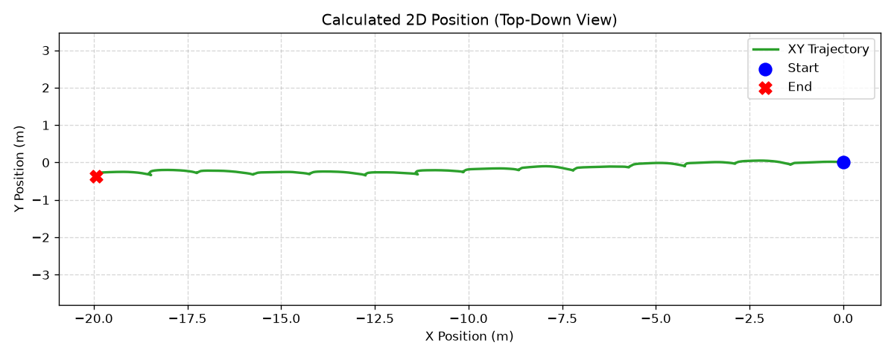
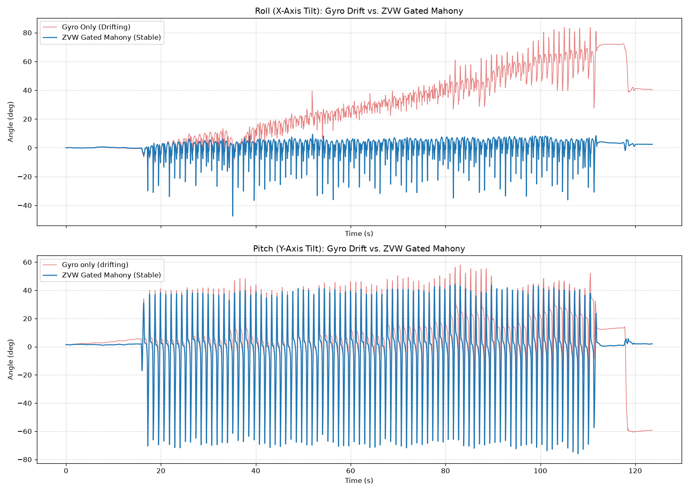
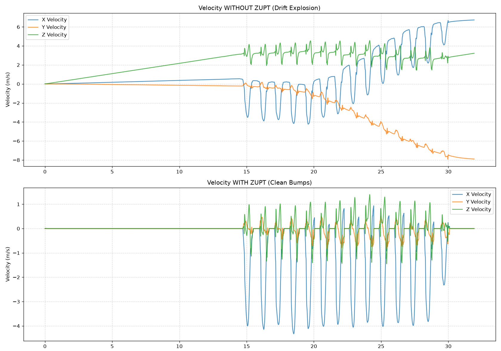
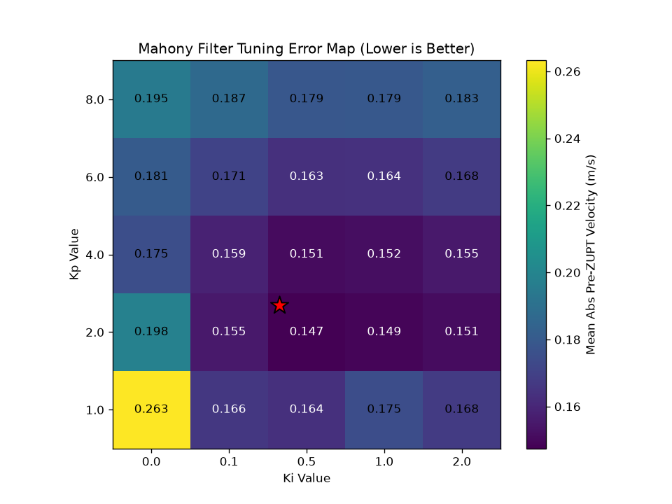
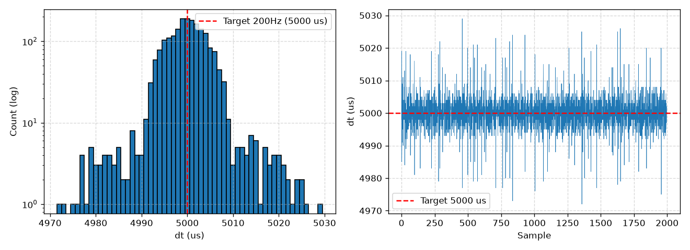

# Foot-Mounted IMU Tracking System

Foot-mounted inertial navigation for indoor mapping and dead reckoning using zero-velocity updates (ZUPT). The system targets under a 5% distance error over 20 m trajectories, utilizing a BMI270 IMU on an nRF52840 (Arduino Nano 33 BLE Rev2) secured via a rigid shoe mount.

## System Performance & Headline Results

| Metric | Result | Target |
| :--- | :--- | :--- |
| **Straight-Line Distance Error** | Mean: +0.51% (Std: 1.47%, Worst single run: 2.59%) across 4 × 20 m walks. | < 5.0% |
| **ZVW Detection Accuracy** | 100% (20/20 on tuning set, 10/10 on held-out validation). | 100% |
| **Loop Timing** | 200 Hz scheduler maintained. Jitter tightly spiked at 5,000 µs. | 5,000 µs |
| **Attitude Stability** | Settled noise σ < 0.01°, ~20 s initial convergence. Dynamic tilt-and-return recovery: < 0.5°. | < 1.0° |

   
  <em>Figure 1: Final 2D calculated trajectory plotting the full 20 m walk.</em>

---

## Phase 2: Algorithm Pipeline & Sensor Fusion

### 1. Attitude Verification & ZVW-Gated Mahony
To prevent the gyroscope from drifting during human gait, a Mahony filter is aggressively gated by the Zero Velocity Window (ZVW) mask. The accelerometer correction only applies when the foot is planted, allowing the filter to run open-loop on the gyro during the swing phase.

**Verification Results (Tuned at $K_p=2.0, K_i=0.5$):**
* **60s Stationary:** Roll -0.994° (σ < 0.01°), Pitch +0.764° (σ < 0.01°). The filter exhibits a ~20 s initial integral convergence before maintaining a stable, flat baseline.
* **Tilt-and-Return:** Recovered with errors of 0.225°/0.153° on one axis, and 0.464°/0.307° on the other, after rapid dynamic excursions to -34° and -41°. 

   
  <em>Figure 2: 80° uncontrolled gyro drift divergence against a bounded trace using the ZVW-gated Mahony filter (tilt residual < 2° measured during ZVW).</em>

### 2. Error Mechanism & Integration Pipeline
The system relies on double integration of linear acceleration, with ZUPT resetting velocity to zero at every stance phase. The causal chain of integration error was successfully identified and quantified:
* **The Mechanism:** Pre-ZUPT velocity predicts the final distance error with an incredibly strong correlation ($r = -0.997, n = 4$). 
* **Physics Match:** The fitted slope of this error (-5.70 m per m/s) matches the analytical physical prediction ($\frac{1}{2}vTN$) to within 10%, confirming the causal chain from attitude tilt error $\rightarrow$ gravity leakage $\rightarrow$ integration drift.

   
  <em>Figure 3: Velocity integration with and without Zero Velocity Updates (ZUPT) demonstrating the instantaneous mitigation of linear velocity drift.</em>

### 3. Kp/Ki Tuning & The Controlled Experiment
Initial testing ($K_p=1.0, K_i=0.0$) yielded a 4.16% run-to-run standard deviation. The parameters were retuned against mean absolute pre-ZUPT velocity on the unmeasured long walk to avoid overfitting. 
* **Optimal Gains:** `Kp = 2.0`, `Ki = 0.5`. 

| Metric | Before ($K_p=1.0, K_i=0.0$) | After ($K_p=2.0, K_i=0.5$) | Improvement |
| :--- | :--- | :--- | :--- |
| **Mean Distance Error** | 19.919 m (-0.33%) | 20.087 m (+0.51%) | Unbiased baseline |
| **Distance Std Dev (Scatter)** | 0.831 m (4.16%) | 0.295 m (1.47%) | **2.8× reduction** |
| **Worst Single Run** | 5.65% | 2.59% | **< 5% target met** |

* **The Controlled Experiment:** Applying the retuned gains dropped horizontal (X/Y) tilt residuals by a factor of 20 (tilt error down from ~0.9° to ~0.05°), while vertical (Z) residuals remained unchanged at 0.026 g. This experimentally confirms the decomposition: horizontal residuals stem from filter attitude error, while vertical residuals are uncorrectable accelerometer hardware magnitude bias.

| Run | Z-Residual Before ($g$) | Z-Residual After ($g$) | Horizontal Tilt Error Before | Horizontal Tilt Error After | Tilt Reduction |
| :--- | :--- | :--- | :--- | :--- | :--- |
| **Run 1** | 0.0261 | 0.0264 | 0.81° | 0.049° | 16.5x |
| **Run 2** | 0.0257 | 0.0260 | 0.77° | 0.038° | 20.3x |
| **Run 3** | 0.0233 | 0.0238 | 0.98° | 0.053° | 18.5x |
| **Run 4** | 0.0233 | 0.0233 | 0.37° | 0.011° | 33.6x |

   
  <em>Figure 4: Kp/Ki tuning grid scores showing a broad plateau of stability, proving the selected values (2.0/0.5) generalize and are not overfitted to noise.</em>

---

## Phase 1: Hardware Engineering Log & Characterization

### 1. I2C Read Path & Scheduler Optimization
**Measurement:** Initial loop timings using the stock wrapper library yielded an I2C read cost of 10,488 µs, consistently missing the 5,000 µs (200 Hz) deadline budget.

**Analysis:** By testing the bus at both 100 kHz and 400 kHz, the time profile was modeled to separate fixed overhead that does not scale with bus clock from physical wire transmission time. This revealed ~1,674 µs of fixed CPU overhead per read caused by redundant API calls.

<table>
  <tr>
    <td width="50%">
      
    </td>
    <td width="50%">
      
    </td>
  </tr>
  <tr>
    <td align="center"><em>Figure 5: I2C mean: 10394 µs, Wire1 I2C bus (f) = 100kHz</em></td>
    <td align="center"><em>Figure 6: I2C mean: 3736 µs, Wire1 I2C bus (f) = 400kHz</em></td>
  </tr>
</table>

**Decision:** Bypassed the library wrapper for raw register-level access via a contiguous 12-byte burst read at 400 kHz.
**Result:** Read time dropped to 477 µs (a 22× speedup). The 200 Hz scheduler was successfully maintained, with jitter strictly bounded: dt mean 5000 µs, min 4972, max 5029, and 0 missed deadlines over 60,000 samples (5 minutes).

   
  <em>Figure 7: Burst-read loop timing. dt mean 5000 µs, min 4972, max 5029, 0 missed deadlines over 60,000 samples (5 minutes).</em>

### 2. Sensor Configuration Discovery
**Measurement:** Initial logs revealed a 50.6% duplicate frame rate and signal clipping due to default 100 Hz ODR and ±4 g ranges.
**Decision:** Wrote directly to hardware configuration registers to explicitly force 200 Hz ODR, ±16 g range, and hardware OSR2 filtering.
**Result:** 
* Duplicate frames collapsed to 0%.
* LSB = 0.488 mg (observed alternating between 0.0004 and 0.0005 g in 4-dp logs), securing the ±16 g range without losing real data to quantization noise beneath the 1.5 mg hardware noise floor.

### 3. Real World Gait Validation
**Measurement:** Validation of sensor configurations against physical human gait metrics.
* **Range Justification:** Peak dynamic walking magnitude reached 11.4 g (heel strike), empirically justifying the ±16 g accelerometer range. Peak gyro swing reached 1,360 dps (68% of the gyro's full scale), validating the ±2000 dps range requirement.
* **Axis Frame Establishment:** A physical rotation consistency test proved that the stock library's axis remap was improper (det = -1, gravity landed on -Y). The remap was discarded in favor of the hardware native frame.
* **The Empirical Case for ZARU:** Gyro bias was observed moving by 0.19 °/s between testing sessions. This session-to-session instability forms the empirical, quantitative justification for requiring a Zero Angular Rate Update (ZARU) algorithm for heading corrections.

### 4. Zero Velocity Window (ZVW) Detection
**Objective:** Identify the exact moments the foot is perfectly still to allow for velocity resets (ZUPT).
**Method:** A three-condition detector evaluating sample-by-sample acceleration magnitude (1.0 g band), gyroscope magnitude, and a trailing rolling variance, requiring a minimum 20-sample dwell time.

**Evaluation:** 
* **Accuracy:** Empirically validated on held-out data with a 100% detection rate (20/20 on the tuning set alongside 10/10 on the held-out validation walk).
* **Boundary Precision:** Algorithm entry boundaries agreed with manual ground truth to a mean offset of +1.4 samples (ranging -3 to +7). Exit boundaries were systematically late by 8–12 samples across every window due to the trailing 15-sample variance threshold holding the gate open.

---

## Limitations & Future Work
- **Vertical position not corrected:** Z closure error is 0.43–0.59 m over 20 m on a level floor. Excluded by design — barometer indoor accuracy is worse than the objects being measured.
- **No heading correction yet:** ZARU, loop closure, and Manhattan snapping are not implemented. Maps are body-relative with arbitrary north.
- **Pipeline runs offline in Python:** Firmware currently logs data only; no on-board estimation or BLE transmission is active.
- **Accelerometer calibration measured but unapplied:** (Bias 1.22%, scale 0.92% on the Z-axis).

---

## Appendix: Architecture & Preemption Safety

### Hardware FPU Validation
The mapper's Mahony filter runs at a fixed 200 Hz, granting a hard 5,000 µs budget. To leave headroom for I2C polling and the BLE stack, hardware floating point flags were enabled on suspicion and then empirically measured (`-mfpu=fpv4-sp-d16 -mfloat-abi=softfp`). 

| Build configuration            | Work time | Loop budget consumed |
| :--------------------------- | --------: | -------------------: |
| Soft float (emulated)        |  ~889 µs  |               18.0 % |
| Hard float (Cortex M4F FPU)  |  ~101 µs  |                2.0 % |

While soft-float would have sufficed at 18% of the budget, activating the FPU yielded an 8.8× speedup. This physical measurement successfully turned a guess into a defensible architectural decision, reclaiming 16% of the loop budget.

### Thread Preemption Safety
The Nano 33 BLE runs Mbed OS beneath the sketch. Across 120,000 iterations, processing time showed ~50 µs of preemption-induced variance. Bit-for-bit comparison of the resulting floats yielded 0 mismatches, confirming the scheduler correctly preserves FPU register context during thread preemption.
