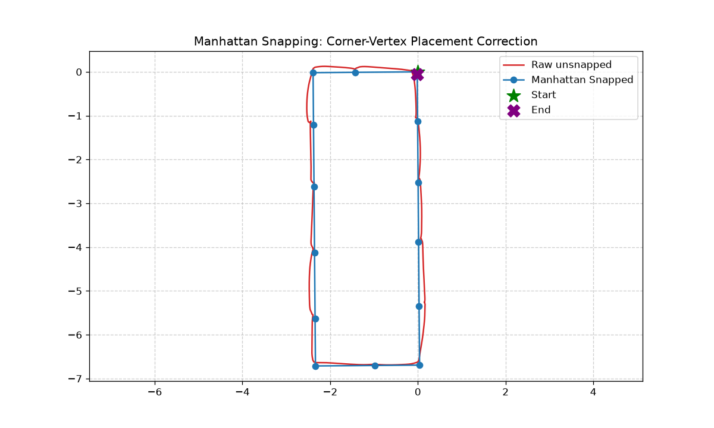
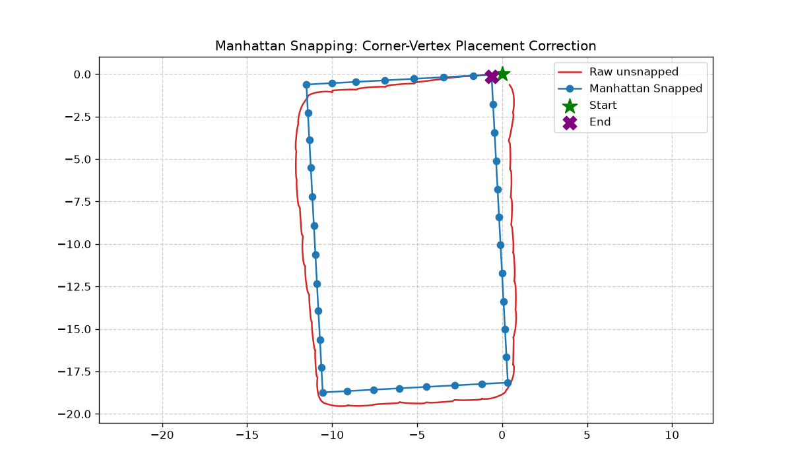
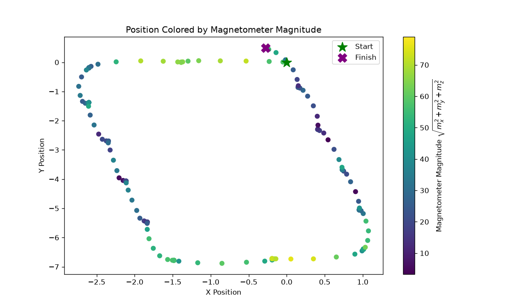
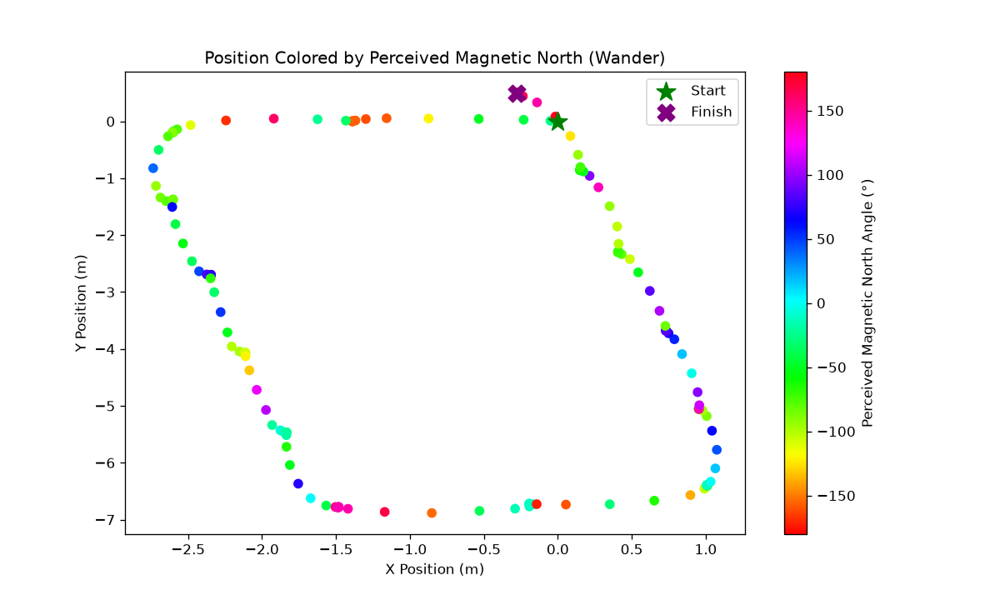

# Foot-Mounted IMU Tracking System

Foot-mounted inertial navigation for indoor mapping and dead reckoning using zero-velocity updates (ZUPT). The system targets under a 5% distance error over 20 m trajectories, utilizing a BMI270 IMU on an nRF52840 (Arduino Nano 33 BLE Rev2) secured via a rigid shoe mount.

## System Performance & Headline Results

| Metric | Result | Target |
| :--- | :--- | :--- |
| **Straight-Line Distance Error** | Mean: +0.51% (Std: 1.47%, Worst single run: 2.59%) across 4 × 20 m walks. | < 5.0% |
| **ZVW Detection Accuracy** | 100% (20/20 on tuning set, 10/10 on held-out validation). | 100% |
| **Loop Timing** | 200 Hz scheduler maintained. Jitter tightly spiked at 5,000 µs. | 5,000 µs |
| **Attitude Stability** | Settled noise σ < 0.01°, ~20 s initial convergence. Dynamic tilt-and-return recovery: < 0.5°. | < 1.0° |
| **Closed-Loop Wall Accuracy** | 2.95% (short walls), 2.14% (long walls) across 14 loops of a tape-measured 2.4 × 6.6 m room. | qualitative |
| **Loop Closure Gap** | 0.212 m after Manhattan snapping (1.18% of an 18 m perimeter), down from 0.699 m unsnapped. | qualitative |

   
  <em>Figure 1: Final 2D calculated map to a 18m (2.4 x 6.6 m) rectangle.</em>

---

## Algorithm Pipeline & Sensor Fusion

### 1. Attitude Verification & ZVW-Gated Mahony
To prevent the gyroscope from drifting during human gait, a Mahony filter is aggressively gated by the Zero Velocity Window (ZVW) mask. The accelerometer correction only applies when the foot is planted, allowing the filter to run open-loop on the gyro during the swing phase.

**Verification Results (Tuned at $K_p=2.0, K_i=0.5$):**
* **60s Stationary:** Roll -0.994° (σ < 0.01°), Pitch +0.764° (σ < 0.01°). The filter exhibits a ~20 s initial integral convergence before maintaining a stable, flat baseline.
* **Tilt-and-Return:** Recovered with errors of 0.225°/0.153° on one axis, and 0.464°/0.307° on the other, after rapid dynamic excursions to -34° and -41°. 

   
  <em>Figure 2: 80° uncontrolled gyro drift divergence against a bounded trace using the ZVW-gated Mahony filter (tilt residual < 2° measured during ZVW).</em>

### 2. Error Mechanism & Integration Pipeline
The system relies on double integration of linear acceleration, with ZUPT resetting velocity to zero at every stance phase. The causal chain of integration error was identified and quantified:
* **The Mechanism:** Pre-ZUPT velocity predicts the final distance error with a strong correlation ($r = -0.997, n = 4$). 
* **Physics Match:** The fitted slope of this error (-5.70 m per m/s) matches the analytical physical prediction ($\frac{1}{2}vTN$) to within 10%, confirming the causal chain from attitude tilt error $\rightarrow$ gravity leakage $\rightarrow$ integration drift.

   
  <em>Figure 3: Velocity integration with and without Zero Velocity Updates (ZUPT) demonstrating the instantaneous mitigation of linear velocity drift.</em>

### 3. Kp/Ki Tuning & The Controlled Experiment
Initial testing ($K_p=1.0, K_i=0.0$) yielded a 4.16% run-to-run standard deviation. The parameters were retuned against mean absolute pre-ZUPT velocity on the unmeasured long walk to avoid overfitting. 
* **Optimal Gains:** `Kp = 2.0`, `Ki = 0.5`. 

| Metric | Before ($K_p=1.0, K_i=0.0$) | After ($K_p=2.0, K_i=0.5$) | Improvement |
| :--- | :--- | :--- | :--- |
| **Mean Distance Error** | 19.919 m (-0.33%) | 20.087 m (+0.51%) | Unbiased baseline |
| **Distance Std Dev (Scatter)** | 0.831 m (4.16%) | 0.295 m (1.47%) | **2.8× reduction** |
| **Worst Single Run** | 5.65% | 2.59% | **< 5% target met** |

* **The Controlled Experiment:** Applying the retuned gains dropped horizontal (X/Y) tilt residuals by a factor of 20 (tilt error down from ~0.9° to ~0.05°), while vertical (Z) residuals remained unchanged at 0.026 g. This experimentally confirms the decomposition: horizontal residuals stem from filter attitude error, while vertical residuals are uncorrectable accelerometer hardware magnitude bias.

| Run | Z-Residual Before ($g$) | Z-Residual After ($g$) | Horizontal Tilt Error Before | Horizontal Tilt Error After | Tilt Reduction |
| :--- | :--- | :--- | :--- | :--- | :--- |
| **Run 1** | 0.0261 | 0.0264 | 0.81° | 0.049° | 16.5x |
| **Run 2** | 0.0257 | 0.0260 | 0.77° | 0.038° | 20.3x |
| **Run 3** | 0.0233 | 0.0238 | 0.98° | 0.053° | 18.5x |
| **Run 4** | 0.0233 | 0.0233 | 0.37° | 0.011° | 33.6x |

   
  <em>Figure 4: Kp/Ki tuning grid scores showing a broad plateau of stability, proving the selected values (2.0/0.5) generalize and are not overfitted to noise.</em>

### 4. Closed-Loop Validation & Manhattan Snapping

**Objective:** Convert a drifting free-running trajectory into a metric floor plan, and quantify how much of the residual error is recoverable by geometric prior rather than by better estimation.

**Method:** Step vectors are extracted at ZVW midpoints and filtered to strides above 0.2 m to reject micro-movements. Dominant building orientation is recovered by a stride-length-weighted circular mean of step headings taken modulo 90°, which yields a single grid offset per walk. Every step heading is then snapped to the nearest grid axis and the path is reconstructed from the snapped headings, preserving the original step magnitudes. No loop-closure constraint is applied: the closure gap is measured, not enforced.

**Dataset:** 14 closed-loop walks of a tape-measured 2.4 × 6.6 m rectangle (18.0 m perimeter), split across both turn directions and with and without deliberate corner pauses.

| Metric | Result |
| :--- | ---: |
| Mean perimeter | 18.034 m (+0.19% vs 18.0 m tape) |
| Perimeter scatter | 0.199 m (1.11%) |
| Closure gap, unsnapped | 0.699 m (3.88% of perimeter) |
| Closure gap, snapped | 0.212 m (1.18% of perimeter) |
| Best single closure | 0.013 m |

**Per-wall accuracy (n = 28 walls per class):**

| Wall class | Tape | Mean abs error | As % of wall | Mean signed error |
| :--- | ---: | ---: | ---: | ---: |
| Short (2.4 m) | 2.4 m | 0.071 m | 2.95% | −0.056 m |
| Long (6.6 m) | 6.6 m | 0.141 m | 2.14% | +0.073 m |

**Result:** Snapping reduces mean closure gap by 3.3× without imposing a closure constraint, so the improvement is evidence that the heading estimate was genuinely near-orthogonal rather than an artifact of forcing the path shut. Perimeter accuracy is unaffected by snapping because step magnitudes are preserved; the +0.19% figure is the raw ZUPT integration result.

**The resolution limit:** Per-wall error is an absolute floor of roughly 0.1 m, not a percentage. Short walls appear worse only because the same physical error is divided by a smaller number. The mechanism is structural: a wall is measured as an integer number of stance-to-stance vectors, and the corner vertex lands on the nearest detected stance rather than on the true corner, so each wall carries a sub-stride placement error. The signed errors confirm a small real transfer, with short walls losing 0.056 m and long walls gaining 0.073 m, and the four per-wall errors summing to the +0.034 m perimeter error.

**The ZARU Negative Result:** A Zero Angular Rate Update (ZARU) algorithm was fully implemented to combat the empirical session-to-session gyro bias drift. However, controlled closed-loop experiments revealed that applying ZARU degraded closure accuracy (e.g., gap worsened from 1.62 m to 3.03 m on a 3-minute walk). The data proved that the Mahony filter's integral term ($K_i$), when aggressively gated by the ZVW, already fully absorbs the Z-axis bias during stance phases. ZARU was therefore proven redundant for stance-rich walks and deliberately excluded from the final estimation pipeline to prevent double-correction.

Intersecting adjacent snapped wall lines by least squares would place true corner vertices and recover the systematic ~0.06 m component. This was deliberately not built: the recoverable systematic error is smaller than the 0.07 to 0.14 m irreducible random component, so the refinement would improve a metric already at ~3% while leaving the dominant term untouched. Documented as available and unbuilt, alongside the accelerometer calibration.

**Open observation:** Closure gap splits cleanly by turn direction. Clockwise walks average a 0.334 m unsnapped gap; counter-clockwise walks average 1.137 m. Elapsed time was tested as a cause and ruled out: the longest clockwise walk (56.0 s) closed 7.8× tighter than a shorter counter-clockwise walk (46.8 s), and the asymmetry persists at matched 22.9 s durations. The cause is not established and n = 5 for the counter-clockwise group, so no mechanism is claimed here.

   
  <em>Figure 8: Unmeasured long loop walk.</em>

---

## Hardware Engineering Log & Characterization

### 1. I2C Read Path & Scheduler Optimization
**Measurement:** Initial loop timings using the stock wrapper library yielded an I2C read cost of 10,488 µs, consistently missing the 5,000 µs (200 Hz) deadline budget.

**Analysis:** By testing the bus at both 100 kHz and 400 kHz, the time profile was modeled to separate fixed overhead that does not scale with bus clock from physical wire transmission time. This revealed ~1,674 µs of fixed CPU overhead per read caused by redundant API calls.

<table>
  <tr>
    <td width="50%">
      
    </td>
    <td width="50%">
      
    </td>
  </tr>
  <tr>
    <td align="center"><em>Figure 5: I2C mean: 10394 µs, Wire1 I2C bus (f) = 100kHz</em></td>
    <td align="center"><em>Figure 6: I2C mean: 3736 µs, Wire1 I2C bus (f) = 400kHz</em></td>
  </tr>
</table>

**Decision:** Bypassed the library wrapper for raw register-level access via a contiguous 12-byte burst read at 400 kHz.
**Result:** Read time dropped to 477 µs (a 22× speedup). The 200 Hz scheduler was maintained, with jitter strictly bounded: dt mean 5000 µs, min 4972, max 5029, and 0 missed deadlines over 60,000 samples (5 minutes).

   
  <em>Figure 7: Burst-read loop timing. dt mean 5000 µs, min 4972, max 5029, 0 missed deadlines over 60,000 samples (5 minutes).</em>

### 2. Sensor Configuration Discovery
**Measurement:** Initial logs revealed a 50.6% duplicate frame rate and signal clipping due to default 100 Hz ODR and ±4 g ranges.
**Decision:** Wrote directly to hardware configuration registers to explicitly force 200 Hz ODR, ±16 g range, and hardware OSR2 filtering.
**Result:** 
* Duplicate frames collapsed to 0%.
* LSB = 0.488 mg (observed alternating between 0.0004 and 0.0005 g in 4-dp logs), securing the ±16 g range without losing real data to quantization noise beneath the 1.5 mg hardware noise floor.

### 3. Real World Gait Validation
**Measurement:** Validation of sensor configurations against physical human gait metrics.
* **Range Justification:** Peak dynamic walking magnitude reached 11.4 g (heel strike), empirically justifying the ±16 g accelerometer range. Peak gyro swing reached 1,360 dps (68% of the gyro's full scale), validating the ±2000 dps range requirement.
* **Axis Frame Establishment:** A physical rotation consistency test proved that the stock library's axis remap was improper (det = -1, gravity landed on -Y). The remap was discarded in favor of the hardware native frame.
* **The Empirical Case for ZARU:** Gyro bias was observed moving by 0.19 °/s between testing sessions. This session-to-session instability forms the empirical, quantitative justification for investigating a Zero Angular Rate Update (ZARU) algorithm for heading corrections.

### 4. Zero Velocity Window (ZVW) Detection
**Objective:** Identify the exact moments the foot is perfectly still to allow for velocity resets (ZUPT).
**Method:** A three-condition detector evaluating sample-by-sample acceleration magnitude (1.0 g band), gyroscope magnitude, and a trailing rolling variance, requiring a minimum 20-sample dwell time.

**Evaluation:** 
* **Accuracy:** Empirically validated on held-out data with a 100% detection rate (20/20 on the tuning set alongside 10/10 on the held-out validation walk).
* **Boundary Precision:** Algorithm entry boundaries agreed with manual ground truth to a mean offset of +1.4 samples (ranging -3 to +7). Exit boundaries were systematically late by 8–12 samples across every window due to the trailing 15-sample variance threshold holding the gate open.

### 5. Magnetometer Characterization
**Objective:** Empirically quantify local magnetic field distortions within an indoor environment to determine the viability of magnetometer-based yaw correction.

**Method:** Map the raw magnetic field magnitude and the perceived global magnetic north across a closed-loop walking trajectory. The perceived north was calculated by rotating the raw magnetometer vectors into the world frame using the Mahony filter's local quaternion estimate at each sample, isolating the environmental field direction.

**Conclusion:** The local magnetic field exhibits severe spatial distortion, rendering the magnetometer unusable for heading estimation in this environment. Perceived magnetic north diverges across the full 360° spectrum along the trajectory. Because this angular wander correlates heavily with global spatial position rather than local sensor orientation (e.g., along a straight wall, foot orientation remained within a ~26° variance while perceived north swung by 202°), the interference is dominated by world-fixed structural elements (e.g., floor rebar, steel beams). This spatial variance cannot be corrected via standard sensor-frame calibration, necessitating the deactivation of magnetometer updates for indoor tracking.

<table>
  <tr>
    <td width="50%">
      
    </td>
    <td width="50%">
      
    </td>
  </tr>
  <tr>
    <td align="center"><em>Figure 9: Magnetometer Magnitude across a 2.4x6.6 m loop</em></td>
    <td align="center"><em>Figure 10: Magnetometer wander readings across a 2.4x6.6 m loop</em></td>
  </tr>
</table>

---

## Limitations & Future Work
- **Heading is body-relative:** Manhattan snapping recovers building orientation and is validated above, but loop-closure distribution is not applied to measurement outputs to avoid corrupting raw trajectory data. Maps have no absolute north.
- **Corner vertices land on stances, not true corners:** ~0.1 m per-wall placement floor. A least-squares wall-line intersection would recover the systematic ~0.06 m component; not built, see §4.
- **Direction-dependent closure asymmetry unexplained:** see §4.
---

## Appendix: Architecture & Preemption Safety

### Hardware FPU Validation
The mapper's Mahony filter runs at a fixed 200 Hz, granting a hard 5,000 µs budget. To leave headroom for I2C polling and the BLE stack, hardware floating point flags were enabled on suspicion and then empirically measured (`-mfpu=fpv4-sp-d16 -mfloat-abi=softfp`). 

| Build configuration            | Work time | Loop budget consumed |
| :--------------------------- | --------: | -------------------: |
| Soft float (emulated)        |  ~889 µs  |               18.0 % |
| Hard float (Cortex M4F FPU)  |  ~101 µs  |                2.0 % |

While soft-float would have sufficed at 18% of the budget, activating the FPU yielded an 8.8× speedup. This physical measurement turned a guess into a defensible architectural decision, reclaiming 16% of the loop budget.

### Thread Preemption Safety
The Nano 33 BLE runs Mbed OS beneath the sketch. Across 120,000 iterations, processing time showed ~50 µs of preemption-induced variance. Bit-for-bit comparison of the resulting floats yielded 0 mismatches, confirming the scheduler correctly preserves FPU register context during thread preemption.
